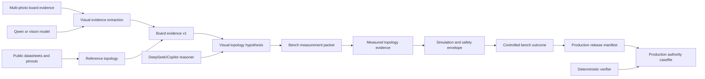

# Circuit.AI Hardware Splicer Architecture

## Core Claim

Circuit.AI is an evidence-gated AI agent for circuit board understanding,
repair, reuse, and hardware recomposition. It does not treat visual model output
as electrical truth. It converts model output into measurement plans and only
promotes a board to repair authority after measured evidence and bench outcomes.

## Architecture



## Evidence Authority Levels

| Level | Meaning | Allowed Output |
| --- | --- | --- |
| `visual_candidate` | photos and reference hints only | capture plan and measurement queue |
| `measured_topology` | trusted pinout/rail measurements exist | scoped topology and simulation checks |
| `electrical_simulation` | measured envelope passes deterministic checks | bench protocol and guarded bring-up |
| `controlled_bench` | first-power/function proof recorded | controlled reuse claim |
| `production_repair` | release manifest and artifacts complete | scoped production repair/reuse authority |

## Current Live Demo

Frontend:

```text
/showcase?state=release
```

Backend:

```text
POST /hardware/production-casefile/run
```

The showcase demonstrates:

- evidence packet selection
- board topology visualization
- measurement closure
- authority ladder
- live production casefile response
- runtime model/budget safety strip

## Model Strategy

Models help interpret and plan:

- Qwen VL: candidate board evidence from multi-photo input.
- DeepSeek/Copilot-style reasoners: structured advisory reasoning.
- Local deterministic verifier: final authority gate.

The system is designed so model output can accelerate work but cannot authorize
unsafe hardware actions alone.

## Competition Deliverable

The final demo will show a CH340C USB-serial board moving through:

```text
reference-only evidence -> blocked authority
measured topology -> simulation-ready authority
release evidence -> production repair authorized
```

