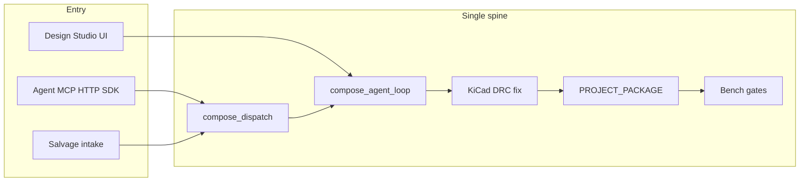

# Product scale plan — Splice Agent (2026–2027)

**Purpose:** Define what we are building, at what depth, in what order — for founder, agents, and future contributors.

**Status:** Active · July 2026  
**Anchor tag:** `v1.1.0-alpha.5`  
**Related:** [`SPLICE_PRODUCT.md`](SPLICE_PRODUCT.md) · [`INTERNAL_MATURITY_PLAN.md`](INTERNAL_MATURITY_PLAN.md) · [`DESIGN_STUDIO_DRC_AGENT.md`](DESIGN_STUDIO_DRC_AGENT.md) · [`AGENT_QUICKSTART.md`](AGENT_QUICKSTART.md)

---

## 1. North star (one sentence)

**An agent-native hardware workbench** where natural language or canvas graphs become KiCad carriers, **DRC and bench measurement are the judge**, and humans inspect the same spine in Design Studio.

**Not:** hosted Flux clone, full schematic editor, JLC checkout SaaS.  
**Yes:** Flux-class **first mile** + auditable **last mile** + salvage/bench moat.

---

## 2. Product spine (do not fork)

```text
Describe (phrase / canvas / donor intake)
    → compose_dispatch (canvas | scratch | llm_first)
    → compose_agent_loop (bounded manual DRC rounds)
    → KiCad compile + drc_fix_loop
    → PROJECT_PACKAGE + bench_session
    → gates → fab / bring-up
```

| Surface | Role |
|---------|------|
| **MCP / HTTP / SDK** | Primary — agents drive the product |
| **Design Studio** | Human legibility on the same endpoints |
| **Salvage / circuit-ai** | Donor intake → same compile path (Phase 2) |
| **KiCad** | Source of schematic/PCB truth — we do not replace it |

**Rule:** No second compile path. UI features call `POST /v1/compose/agent-loop` or `hs_compose_drc_agent`.

---

## 3. Maturity map (honest)

| Tier | Name | Today (alpha.5) |
|------|------|-----------------|
| **S2** | Carrier compile (CI) | ✅ `make verify-splice` |
| **S3** | Bench gates (golden) | ✅ CI; field café deferred |
| **S5 partial** | Greenfield compose | 🟡 Phrase/canvas → 0 DRC errors; `cosmetic_preview` copper |
| **Agent spine** | MCP = HTTP = SDK = UI | 🟡 `hs_compose_drc_agent`, Design Studio agent-loop |
| **Salvage unified** | Donor → same agent loop | ❌ Phase 2 |

---

## 4. Phased execution

### Phase 0 — Alpha stabilize (now → ~4 weeks)

**Goal:** Spine boringly reliable for you + one external agent operator.

| # | Deliverable | Status |
|---|-------------|--------|
| 0.1 | Tag `v1.1.0-alpha.5`, push `main` | This release |
| 0.2 | `docs/PRODUCT_SCALE_PLAN.md` (this file) | ✅ |
| 0.3 | `docs/AGENT_QUICKSTART.md` — 3 curls + 3 MCP calls | ✅ |
| 0.4 | `docs/AGENT_BUILD_DIR_POLICY.md` — MCP `hs_design_quality` paths | ✅ |
| 0.5 | Design Studio: AI phrase → agent-loop + package | ✅ |
| 0.6 | `make verify-product-internal` green | Gate before tag |
| 0.7 | React Flow selection loop fix | ✅ `fb3584e` |

**Exit criteria:** Clone → Qwen key → agent loop in &lt;15 min without author hand-holding. See [`AGENT_QUICKSTART.md`](AGENT_QUICKSTART.md).

---

### Phase 1 — Beta workbench (1–3 months)

**Goal:** Agents are the primary customer; UI is inspection + override.

| Track | Deliverables |
|-------|----------------|
| **Agent API** | Versioned `agent_loop` schema; async job for long compiles; webhook optional |
| **Module graph** | 50+ modules; pin contract validation; LLM picker telemetry |
| **DRC agent** | Smarter fixup policy; `cosmetic_preview` → `review_required` → `fab_ready` ladder |
| **Package** | `PROJECT_PACKAGE` schema version; wiring steps ↔ gate checklist |
| **Salvage bridge** | `donor_context` on `hs_compose_drc_agent` from circuit-ai intake |

**Exit criteria:** Cursor/Claude agent designs → fixes DRC → delivers zip + gate card without browser.

---

### Phase 2 — Product depth (3–9 months)

**Goal:** Flux-class intake + bench moat — not Flux feature parity.

| Track | Deliverables |
|-------|----------------|
| **Design Studio** | Pin wire editing; live DRC hints; open in KiCad one-click |
| **Bench loop** | Camera capture → gate auto-fill; session replay |
| **Salvage** | Photo → functional blocks → splice plan → carrier in one session |
| **Copper truth** | Path from `cosmetic_preview` to autoroute tier when `AUTOROUTE=1` |
| **Integrations** | KiCad MCP sidecar; JLC enrich read-only on BOM |

**Exit criteria:** Repair café case: donor photo → carrier PCB → measured gates → fab zip.

---

### Phase 3 — Scale & distribution (9–18 months)

**Goal:** Self-hosted SKU + one vertical wedge — not mass SaaS.

| Option | Shape |
|--------|-------|
| Self-hosted kit | Docker / `hs-serve` for labs and shops |
| Agent hosting | MCP server as product; UI optional |
| Vertical wedge | Pick one: repair refurb, edu makerspace, IoT module carriers |

**Exit criteria:** 3–5 paying labs; case studies with real DRC + bench evidence.

---

## 5. Explicitly deferred

- Full schematic editor (KiCad stays truth)
- Hosted multi-tenant SaaS
- Production autorouting as default
- JLC one-click order
- Mech splice as day-one blocker
- “Beat Flux” marketing

---

## 6. Metrics (not vanity)

| Phase | Metric |
|-------|--------|
| Alpha | Agent loop success rate; time-to-package; DRC rounds to 0 errors |
| Beta | External agent sessions/week without support |
| Product | % packages with gates closed before power-on |
| Commercial | Paid self-hosted installs; salvage cases completed |

---

## 7. Work allocation (internal)

```text
Phase 0–1:  70% agent spine + DRC honesty + tests
            20% Design Studio legibility (not ECAD parity)
            10% docs when code changes
Phase 2+:   shift toward salvage + bench when Phase 1 exit green
```

Competitive essays and outreach templates are **not** internal gates. See [`INTERNAL_MATURITY_PLAN.md`](INTERNAL_MATURITY_PLAN.md).

---

## 8. Architecture (frozen)



---

## 9. Next actions after alpha.5

1. ~~Run `make verify-product-internal` on second machine; file `INSTALL_REPORT`.~~ ✅ FGEDHGV Track B — [`INSTALL_REPORT_desktop-fgedhgv-wsl_2026-07-09.md`](INSTALL_REPORT_desktop-fgedhgv-wsl_2026-07-09.md)
2. Phase 1 kickoff: async `POST /v1/jobs` wrapper for `compose/agent-loop`.
3. Expand module catalog toward 50 entries with pin validation tests.
4. Unify salvage intake → `hs_compose_drc_agent` with `donor_context`.

---

## 10. Changelog

| Date | Change |
|------|--------|
| 2026-07-08 | Initial product scale plan; Phase 0 doc + studio wiring for alpha.5 |
