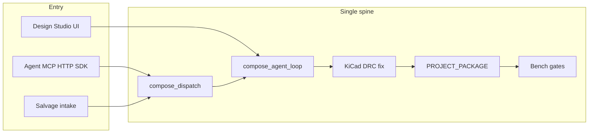

# Product scale plan — Splice Agent (2026–2027)

**Purpose:** Define what we are building, at what depth, in what order — for founder, agents, and future contributors.

**Status:** Active · July 2026  
**Anchor tag:** `v1.1.0-alpha.16`  
**Cold-internal exit:** ✅ declared — see [`COLD_INTERNAL_EXIT.md`](COLD_INTERNAL_EXIT.md)  
**Related:** [`SPLICE_PRODUCT.md`](SPLICE_PRODUCT.md) · [`INTERNAL_MATURITY_PLAN.md`](INTERNAL_MATURITY_PLAN.md) · [`DESIGN_STUDIO_DRC_AGENT.md`](DESIGN_STUDIO_DRC_AGENT.md) · [`AGENT_QUICKSTART.md`](AGENT_QUICKSTART.md) · [`AGENT_DRY_RUN_CHECKLIST.md`](AGENT_DRY_RUN_CHECKLIST.md)

---

## 1. North star (one sentence)

**An agent-native hardware workbench** where natural language or canvas graphs become KiCad carriers, **DRC and bench measurement are the judge**, and humans inspect the same spine in Design Studio.

**Not:** hosted Flux clone, full schematic editor, JLC checkout SaaS.  
**Yes:** Flux-class **first mile** + auditable **last mile** + salvage/bench moat.

---

## 2. Product spine (do not fork)

```text
Describe (phrase / canvas / donor intake)
    → compose_dispatch (canvas | scratch | llm_first)
    → compose_agent_loop (bounded manual DRC rounds)
    → KiCad compile + drc_fix_loop
    → PROJECT_PACKAGE + bench_session
    → gates → fab / bring-up
```

| Surface | Role |
|---------|------|
| **MCP / HTTP / SDK** | Primary — agents drive the product |
| **Design Studio** | Human legibility on the same endpoints |
| **Salvage / circuit-ai** | Donor intake → same compile path |
| **KiCad** | Source of schematic/PCB truth — we do not replace it |

**Rule:** No second compile path. UI features call `POST /v1/compose/agent-loop` or `hs_compose_drc_agent`.

---

## 3. Maturity map (honest) — alpha.16

| Tier | Name | Today |
|------|------|-------|
| **S2** | Carrier compile (CI) | ✅ `make verify-splice` |
| **S3** | Bench gates | ✅ Sim bench-loop + golden-real + **public-web DMM** provenance |
| **S5 partial** | Greenfield compose | 🟡 Phrase/canvas → 0 DRC; copper default `cosmetic_preview` |
| **Agent spine** | MCP = HTTP = SDK = UI | ✅ Catalog 50, async jobs, agent-loop parity |
| **Salvage unified** | Donor → same agent loop | ✅ `donor_context` on agent-loop / MCP / HTTP |
| **Bench + vision** | Capture assist | ✅ Template + vision-assist draft + operator doc |
| **Donor vision** | Photo → salvage | ✅ Offline evidence + **live Qwen VL** when keyed |
| **Copper honesty** | Fab claims | ✅ Cold bar asserts preview ≠ `fabrication_ready` |
| **Public-web bench** | Internet DMM photos | ✅ Wikimedia LCDs; `public_web_is_not_this_board` |
| **External readiness** | Zero-help dry-run | ✅ **Cold-internal exit** (optiplex + FGEDHGV); strangers optional |

---

## 4. Phased execution

### Phase 0 — Alpha stabilize — **EXITED** (alpha.16)

| # | Deliverable | Status |
|---|-------------|--------|
| 0.1–0.7 | Plan, quickstart, studio, verify, catalog 50 | ✅ |
| 0.8 | Cold-internal dry-run (archive + alien) | ✅ through alpha.16 bar |

**Exit met:** Fresh archive → full quickstart (incl. salvage, bench, vision, public-web DMM, keyed live VL) without author hand-holding.

### Phase 1 — Beta workbench — **COLD EXIT** (alpha.16)

| Track | Status |
|-------|--------|
| Agent API (async jobs) | ✅ |
| Module graph 50 + pins | ✅ |
| Salvage on agent-loop | ✅ |
| DRC → package without browser | ✅ (cold-internal proxy) |
| Copper → `fab_ready` ladder | 🟡 honesty asserted; **autoroute left to maintainer** (not default) |
| Webhook | ⬜ deferred |

**Exit met (cold proxy):** Agent designs → 0 DRC → package + gate card on two machines. Stranger dry-run still welcome, not required.

### Phase 2 — Product depth — **IN PROGRESS**

| Track | Status |
|-------|--------|
| Design Studio deeper ECAD UX | 🟡 agent-loop wired; pin-edit / live DRC deferred |
| Bench loop + camera assist | ✅ compose bench-loop, vision-assist, golden-real, public-web |
| Salvage photo → carrier | ✅ offline + live VL path when keyed |
| Copper truth (autoroute) | 🟡 **maintainer-owned**; opt-in only — do not block product on it |
| Integrations (KiCad MCP / JLC) | ⬜ |

**Exit criteria (unchanged):** Repair café case — donor photo → carrier → **on-board** measured gates → fab zip.

### Phase 3 — Scale & distribution (9–18 months)

Unchanged: self-hosted kit, agent hosting, one vertical wedge.

---

## 5. Explicitly deferred

- Full schematic editor (KiCad stays truth)
- Hosted multi-tenant SaaS
- Production autorouting as **default** (opt-in only; maintainer experiments headless)
- JLC one-click order
- Mech splice as day-one blocker
- “Beat Flux” marketing
- Claiming café evidence from public-web DMM photos

---

## 6. Metrics (not vanity)

| Phase | Metric |
|-------|--------|
| Alpha | Agent loop success; time-to-package; DRC rounds to 0 |
| Beta | Cold-internal green on 2 machines; optional stranger sessions |
| Product | % packages with gates closed before power-on (**on-board** preferred) |
| Commercial | Paid self-hosted installs; salvage cases completed |

---

## 7. Work allocation (internal)

```text
Now:        Phase 2 depth that is not autoroute (studio UX, on-board café when hardware available)
Autoroute:  maintainer-owned; headless only if automated
Phase 3:    when café case + copper story are honest
```

---

## 8. Architecture (frozen)



---

## 9. Next actions (after cold exit)

1. ~~Phase 0 + Phase 1 cold-internal exit.~~ ✅ alpha.16 — [`COLD_INTERNAL_EXIT.md`](COLD_INTERNAL_EXIT.md)
2. On-board café DMM when hardware is available ([`REAL_BENCH_OPERATOR.md`](REAL_BENCH_OPERATOR.md)).
3. Autoroute / `fab_ready` — **maintainer track**; keep default `AUTOROUTE=0`.
4. Design Studio pin-edit / live DRC hints (Phase 2 UX).
5. Optional: stranger dry-run when someone appears.

---

## 10. Changelog

| Date | Change |
|------|--------|
| 2026-07-08 | Initial product scale plan; Phase 0 doc + studio wiring for alpha.5 |
| 2026-07-10 | Maturity through alpha.12–16; cold-internal bar; live VL; public-web DMM |
| 2026-07-10 | Declare Phase 0 / Phase 1 **cold exit** at alpha.16; autoroute left to maintainer |
